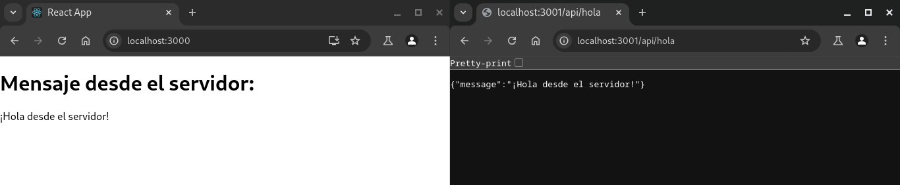

# React Node REST

Este proyecto es una aplicación que utiliza React para el frontend y Node.js para el backend, implementando una API REST.

## Estructura del Proyecto

- **Frontend**: React
- **Backend**: Node.js con Express

## Instalación

1. Clona el repositorio:
    ```bash
    git clone https://github.com/lytsistemas/react-node-example
    ```
2. Navega al directorio del proyecto:
    ```bash
    cd react-node-example
    ```
3. Instala las dependencias del backend:
    ```bash
    cd backend
    npm install
    ```
4. Instala las dependencias del frontend:
    ```bash
    cd ../frontend
    npm install
    ```

## Uso

1. Inicia el servidor backend:
    ```bash
    cd backend
    node server.js
    ```
2. Inicia la aplicación frontend:
    ```bash
    cd ../frontend
    npm start
    ```

## Captura de Pantalla



## Licencia

Este proyecto está bajo la Licencia MIT.
